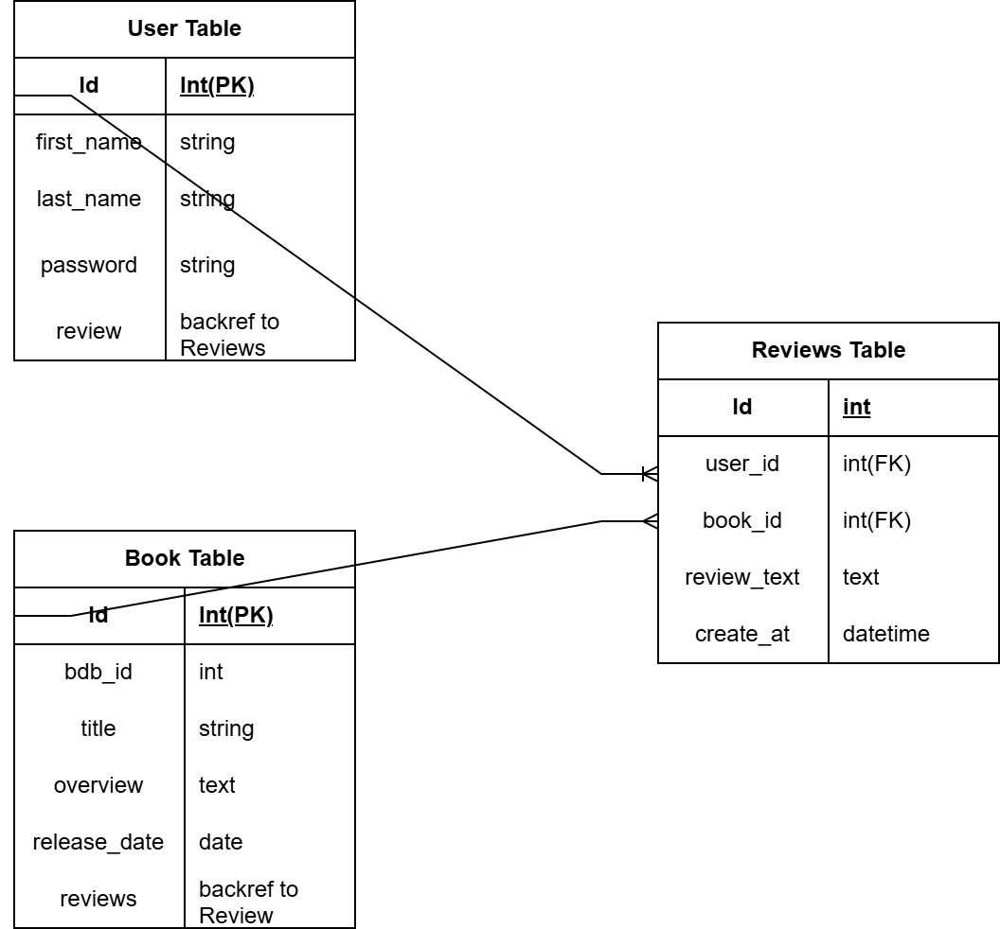
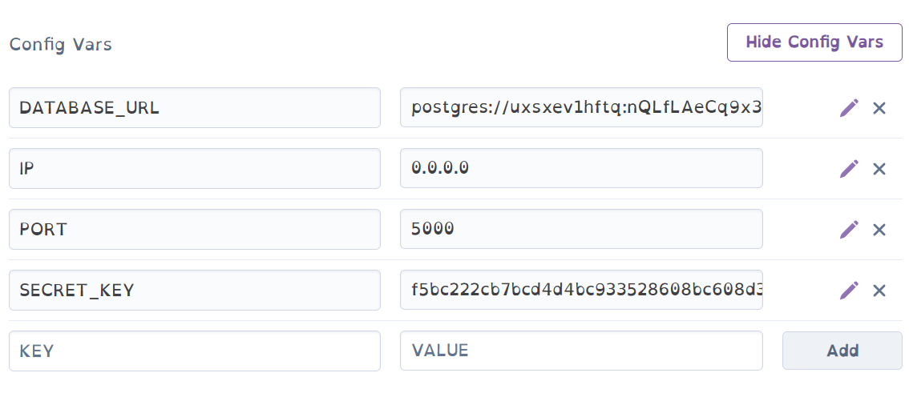

https://padomabook-review-app-f5b05cde500b.herokuapp.com/
https://apostle01.github.io/book1-review-app/
# 
Click here to acces the website.https://git.heroku.com/padomabook-review-app.git

book1-review-app is a simple web application for managing reviews. Users can view, add, and edit book reviews. It includes user authentication and a search functionality. This is my milestone project.

### Tools
1. [Visual Studio Code](https://code.visualstudio.com)
    * This is my IDE of choice for writing my template files for this project.
2. [Git](https://git-scm.com/)
    * Used for version control
3. [Github](https://github.com/)
    * Used to store the code
4. [Balsamiq Wireframes](https://balsamiq.cloud)
    * Used to create wireframes for the project
5 * UTF-8 characters
    * 
6.  Edge
    * Used for testing the webpage during development
7. W3C Html Validation Service
    *Used to validate HTML code
8. W3C Jigsaw CSS Validation Service
    * Used to validate the CSS code
9. [Wave web Accessibility Evaluation Tool]
    * Used to validate the accessibility of the web page
10. [CI Python Linter]
    * Used to validate python code


## Table of Content
1. Introduction
2. Features
3. Installation
    . Pre-requisites
    . Clone the Repository
    . Set Up Environment Variable
    . Install Dependencies
    . Run Migrations
    . Run the Application

4. Usage
5. Deployment
    . Deploy to Heroku

6. Contributing
7. License
8. Acknowledgement

## User Experience (UX)

### Purpose

The primary purpose of the site is to create an engaging and user-friendly platform where book lovers can share and discover other opinions. This website is designed to serve as a comprehensive resource for individuals looking to gain knowledge into thriller and courtroom stories.

#### Why The Site is Needed

- Allow a platform for people who love to read and are enthustistic about other opinions
- User-generated content - 
- Accessibility and ease of use -  book1-review-app is designed with a user-friendly interface that makes it easy for anyone to search for books, read reviews and leave their own.
- Customization and personalization - book1-review-app allows the user to manage their reviews. 

#### Target Audience

- Thriller Enthusiasts: Individuals who love reading and are interested in sharing their opinions and reading reviews from like-minded people.
- General Audience: People who want to read reviews before deciding to read a book.

#### Returning Visitor Goals

- Log into created account.
- Create, edit, and delete my reviews.
- Read other user's reviews.

### User Stories

#### First Time Visitor Goals

- Register for an account.
- Search for movies.
- Understand what the site is for and easily navigate their way around

#### Frequent Visitor Goals

- Log into created account.
- Create, edit, and delete my reviews.
- Read other user's reviews.

### Imagery

All images on the webpage were taken from (https://www.wob.com/en-gb/books). I have credited these in the [credits](#credits) section.

### Wireframes

Wireframes were created for mobile, tablet and desktop using Balsamiq.

[Desktop Wireframes](docs/desktop-wireframes.png)

[Tablet Wireframes](docs/tablet-wireframes.png)

[Mobile Wireframes](docs/mobile-wireframes.png)

### Database Design

book1-review-app is based on a relational database. The database is made up of 3 tables, a User, Book and Review table. The tables are related via their primary and foreign keys in addition to the backrefs which made querying the database easier.

The backref command `reviews = db.relationship(
        'Review', backref='user')` on the User table creates a virtual column on the Review table called user making it easier to query the database. For example, you can access the reviews from the user table using `User.reviews` at the same time you can access a user from the reviews table using `Review.user`. This approach has been beneficial when displaying reviews linked to different users.

The relationship between the tables are as follows:

- User to Review: One-to-Many. One user can write many reviews. This relationship is defined using `db.relationship` in the User model and the `db.ForeignKey` in the Review model.
- Book to Review: One-to-Many. One book can have many reviews. This relationship is defined using `db.relationship` in the Book model and the `db.ForeignKey` in the Review model.




## Features

-User registration and login
-Add new book reviews
-Edit existing book reviews
-Search for a book
-Custom 404 error page

### CRUD Functionality

- book1-review-app meets the requirements of CRUD
   - Create - A user can create their own user account. In addition to this, they can create book reviews.
   - Read - A user can read all user's reviews on the 'Book Reviews' webpage. 
   - Update - A user can modify/update their existing reviews.
   - Delete - A user can delete any review that they have created.


### Future Implementations

- Allow a user to update their password.
- Allow a user to delete their account.
- Add a book rating to each book.
- Create an Admin account to delete inappropriate reviews.
- Allow a user to add a book if it's not found.
- Give the ability to search for book reviews.


## Accessbility

- Using semantic HTML.
- Creating sufficient colour contrast throughout the website.
- Using descriptive alt attributes for images throughout the site.

## Technologies Used

### Languages Used

- HTML, CSS, Javascript and Python

### Frameworks, Libraries and Programs Used

### Database Used

[PostgreSQL](https://www.postgresql.org/) - Relational database used to store the users, movies and reviews.

### Frameworks Used

[Flask](https://pypi.org/project/Flask/) - A micro-framework. Flask login was used alongside Flask to manage user accounts. Flask-Login provides user session management for Flask. It handles the common tasks of logging in, logging out, and remembering your users' sessions over extended periods.

Werkzueg-Security - This allows passwords to be hashed to provide account security to the users of the website. Passwords will not be stored as plain-text and stored as hash which is irreversible to plaintext. This is known as a one-way hash.

[Bootstrap](https://getbootstrap.com/) - v5.3.3 - CSS Framework.

### Libraries and Packages Used

[SQLAlchemy](https://pypi.org/project/SQLAlchemy/) - Database abstraction library, used to interact with PostgreSQL.

[Pip](https://pypi.org/project/pip/) - Tool for installing Python packages.

[Jinja](https://jinja.palletsprojects.com/en/3.1.x/) - Templating engine.

[Balsamiq](https://balsamiq.com/) - Used to create wireframes.

[Vscode](https://vscode.com/) - Used to create the website

[Git](https://git-scm.com/) - For version control.

[Github](https://github.com/) - To save and store the files for the website.

Google Dev Tools - To troubleshoot and test features, and solve issues with responsiveness and styling.

[Am I Responsive](https://ui.dev/amiresponsive) To show the website across a range of devices.

[Shields](https://shields.io/) Add badges to README.

[draw io](https://draw io.com) To create the database schema.

## Installaation

1. Clone the repository

'''sh
git clone https://github.com/Apostle01/book1-review-app.git
cd book1-review-app

2. Create and activate a virtual environment
    python -m venv venv
    source venv/bin/activate # on windows use 'venv\Scripts\activate'

3. Install the dependencies
    pip install -r requirements.txt

4. Set up the database:
    flask db upgrade

5. Run the application:
    python app.py

Deployment on Heroku

1. Install thee Heroku CLI if you haven't already
    curl https://cli-assets.heroku.com/install.sh | sh

2. Log in to your Heroku account:
    heroku login

3. Create a new Heroku application
    heroku create your-app-name

4. Add a PostgresSQL database to your Heroku app:
    heroku addons:create heroku-postgresql:hobby-dev

5. Set the 'Flask-App' and 'Flask_ENV' configuration variables on Heroku:
    heroku config:set Flask_App=app.py
    heroku config:set Flask_ENV=production

6. Initialize the database on Heroku:
    heroku run flask db upgrade

7. Deploy the application to Heroku:
    git add .
    git commit -m "Deploy to Heroku"
    git push heroku main

Usage

Open your web browser and navigate to 'https://padomabook-review-app-f5b05cde500b.herokuapp.com/' to access the application

Routes
. `/register`:Register a new user
. `/login`:Login for existing users
. `/logout`:Logout the current user
. `/`:View all book reviews and add new ones (if logged in)
. `/edit/<int:id>`:Edit a book review (admin only)
. `/delete/<int:id>`:Delete a book review (admin only)

Administrator Privilages

To give a user administrator privilages,  you need to manually update the database. You can do this by running a Python shell within your Flask app context on Heroku:
    heroku run flask shell

Then execute the following commands:
    from models import User
    User = User.query.filter_by(username='your_admin_username').first()
    user.is_admin = True
    db.session.commit()

Replace your_admin_username with the username of the user you want to promote to administrator.

Error Handling

A custom 404 page is provided for handling non-existent routes. You can customize this page by editing the '404.html' file in thee template directoru.

License

This project is licensed under the MIT License. See the LICENSE file for details.

Contributing

If you have any questions or suggestions, feel free to contact the project maintainer at nanaafianyameke2@gmail.com,
please open an issue or submit a pull request for any improvements.

## Accessibility

## Deployment & Local Deployment

### Local Deployment
 For local deployment, the following must be installed:

- [Python 3.12.2](www.python.org) - To run the application.
- [VS Code](https://code.visualstudio.com/) - Or any other suitable IDE.
- [Pip 24.0](https://pypi.org/project/pip/) - Package installer for Python.
- [Github](https://github.com/) - To clone and manage the repository.
- [PostgreSQL](https://www.postgresql.org/) - To create and manage the database.

#### Setup
1. Clone the book1-review-app repository:

   - To clone the ReelTalk repository

      1. Log in (or sign up) to GitHub.
      2. Go to the repository for this project, book1-review-app
      3. Click on the code button, select whether you would like to clone with HTTPS, - SSH or GitHub CLI and copy the link shown.
      4. Open the terminal in your code editor and change the current working directory to the location you want to use for the cloned directory.
      5. Type 'git clone' into the terminal and then paste the link you copied in step 3. Press enter.

2. Create an env.py file in the root directory of the project. Please refer to sample_env.py file for an example. 

3. Type the following command into the terminal to install the Python packages used in book1-review-app.

   - `pip3 install -r requirements.txt`

4. Create the database using PostgreSQL. Type the following commands into the terminal.

   - `psql`
   - `CREATE DATABASE book1-review-app`

5. Add the tables to the reeltalk database using the following commands in the terminal:

    - `python`
    - `from book1-review-app import db`
    - `db.create_all()`
    - `exit()`

- The tables from models.py should now have been added to the book1-review-app database.

6. To check the tables have been created, the following commands can be run:

     - `set_pg`
     - `psql`
     - `\c book1-review-app`
     - `\dt`
- These commands will display all the created tables within the book1-review-app database.

7. The  book1-review-app application can now be run by typing the below into the terminal:

    - `python app.py`

### How to Fork

To fork the repository:

1. Log in (or sign up) to Github.

2. Go to the repository for this project, []).

3. Click the Fork button in the top right corner.

### Remote Deployment Heroku

1. Create a database using [CI Database Maker](https://dbs.ci-dbs.net/). Once created, a URL to the database will be provided. Save this URL for later on in the process.

2. In order for Heroku to run the project, two files need to be created in the IDE workspace.

    - A requirements.txt file contains a list of the Python dependencies that our project needs to run successfully.
    - A Procfile contains the start command to run the project.

- To create the requirements.txt file, run the following command in the terminal:

    ```bash
    pip3 freeze --local > requirements.txt
    ```
- To create the Procfile run the following command in the terminal:

    ```bash
    echo web: python app.py > Procfile
    ```

    NOTE: The Procfile uses a capital P and doesn't have a file extension on the end. Ensure there is no blank line at the end of the file as this can cause problems for deployment.

    Save all files then add, commit and push the changes to GitHub.

3. Login (or sign up) to [Heroku.com](https://www.heroku.com).

4. Click the new button and then click Create New App.

5. Choose a unique name for your app, select the region closest to you and click “Create app.

6. Go to the Settings tab of your new app.

7. Click Reveal Config Vars.

8. Add a Config Var called DATABASE_URL and paste your CI database URL in as the value. Make sure you click “Add”.

9. Add each of your other environment variables except DEVELOPMENT and DB_URL from the env.py file as a Config Var. The result should look something like this:

   

 - NOTE: Delete the DEBUG variable once debugging is complete. 

10. Navigate to the “Deploy” tab of your app.

11. In the Deployment method section, select “Connect to GitHub”.

12. Search for Apostle01/book1-review-app repo and click Connect.

13. Optional: You can click Enable Automatic Deploys in case you make any further changes to the project. This will trigger any time code is pushed to your GitHub repository.

14. Click Deploy Branch - This will start the build process.

15. Similarly to local deployment, the tables from models.py need to be added to the database.

    - To do this, we can click the “More” button and select “Run console”.
    - Type python app.py into the console and click Run.
    - This opens the Python terminal. Now create the tables with the commands:

        ```bash
           from padomabook-review-app import db
        ```
        ```bash
           db.create_all()
        ```
        ```bash
           exit()
        ```

16. The app should now be up and running. Click "Open app" to view the deployed project.

## Testing
Please see [testing.md](testing.md) file for both automated and manual testing of website.

## Credits

### Acknowledgements
    . Flask documentation
    . Bootstrap for the frontend framework
    . SQLAlchemy for database management
    . My Cohort for Support
    . My Tutor for support

This 'README.md' provides comprehesive instructions for local setup and Heroku deployment,
making it easy for others to understand and deploy the app. 