# book1-review-app - Testing

[View book1-review-app on Heroku](https://padomabook-review-app-f5b05cde500b.herokuapp.com/)

## CONTENTS

- [Automated Testing](#Automated-Testing)
  - [W3C Validator](#W3C-Validator)
  - [Wave Testing](#Wave-Testing)
  - [CI Python Linter](#ci-python-linter)
- [Manual Testing](#Manual-Testing)
  - [Testing User Stories](#Testing-User-Stories)
  - [Full Testing](#Full-Testing)
- [Bugs](#bugs)
  - [Solved Bugs](#solved-bugs)
  - [Known Bugs](#known-bugs)

## Testing

Testing was continuous throughout the website build. I used Chrome developer tools to identify and address any issues as they arose.

- My automated testing consisted of using Wave and the CI Linter Python.
- I then manually tested the user stories along with the functionality of the website.

## Automated Testing

### Lighthouse Testing

I took the opportunity to utilize Lighthouse within Chrome Developer Tools. This allowed me to test for performance, accessibility, best practices and the SEO (search engine optimization) of the website.

- All pages pass Googles lighthouse tests for Desktop and Mobile.

#### Desktop Testing

Lighthouse Desktop Testing Screen Shots

  #### Home Page

  #### Login Page

 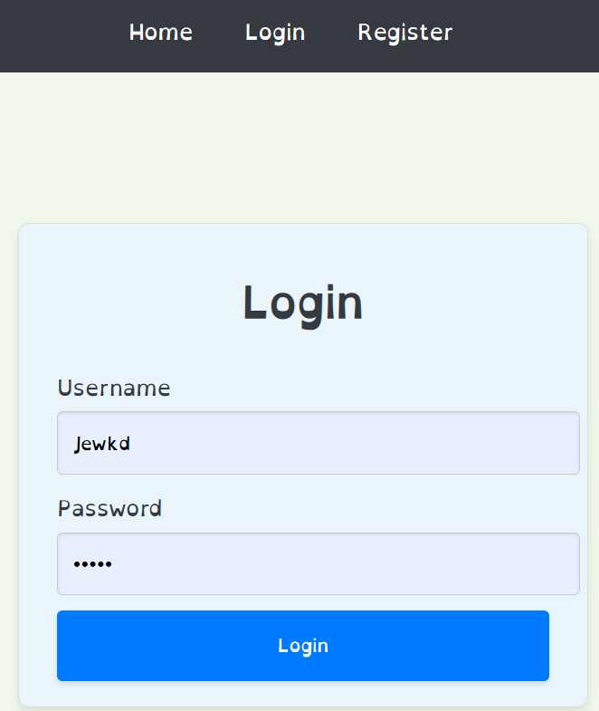

 #### Sign Up Page

 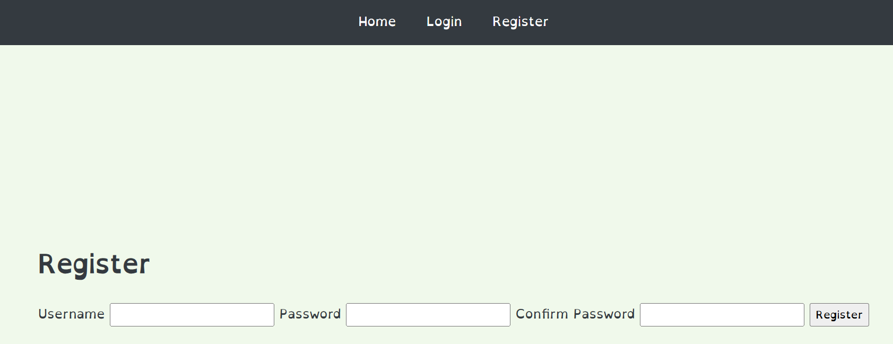
 
 #### Search Page
 
 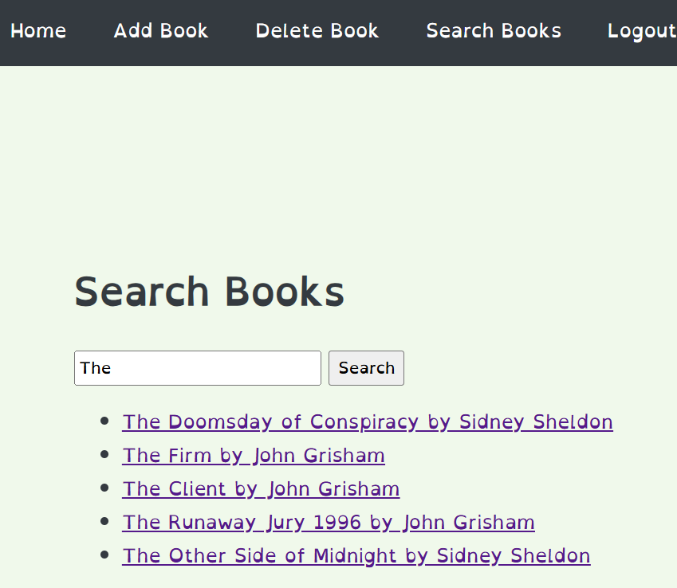
  
 #### 404 Page
 
 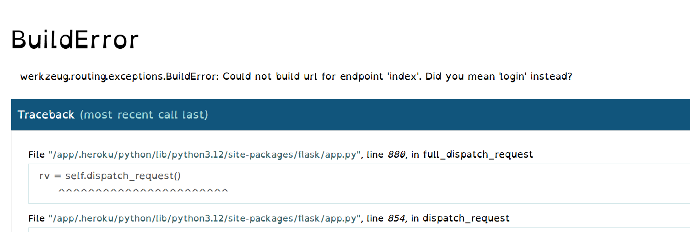
 

#### Mobile Testing

Lighthouse Mobile Testing Screen Shots

  #### Home Page

  #### Login Page

 

 #### Sign Up Page

 
 
 #### Search Page
 
 
 
  #### Add Review Page
 
 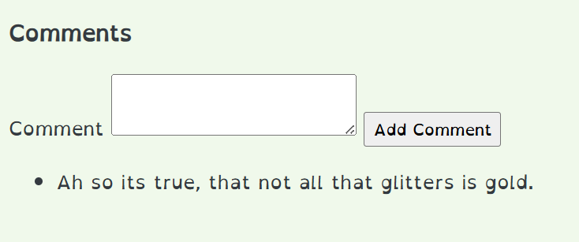
 
 #### 404 Page
 
 

 

### Wave Testing

Wave Testing Screen Shots

- All pages pass the Wave validator.

  #### Home Page

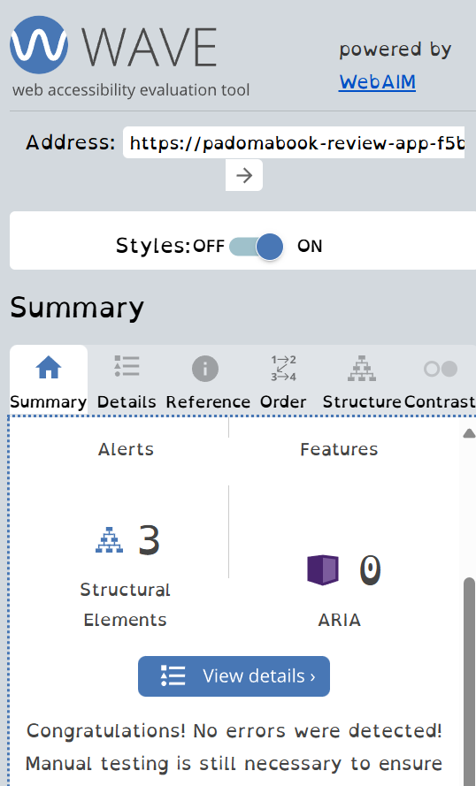

  #### Login Page

 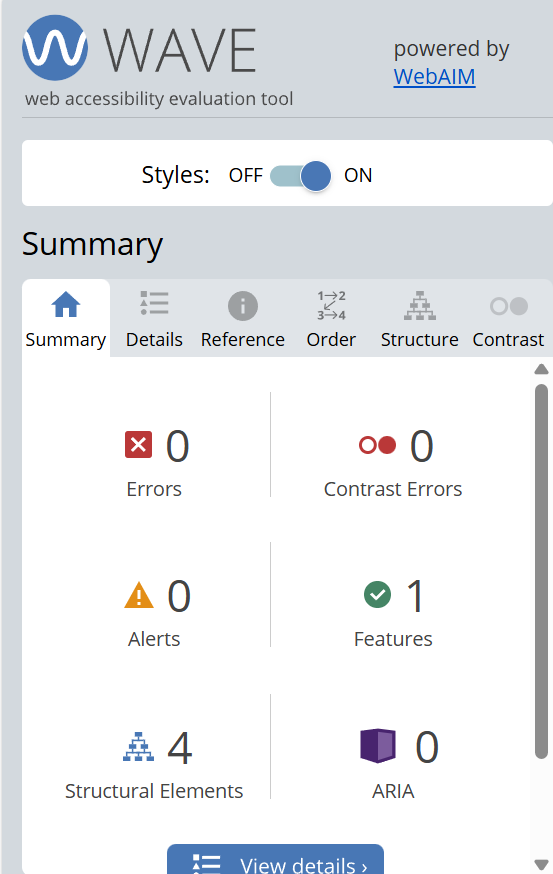

 #### Register Page

 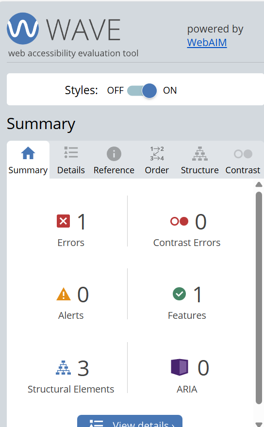
 

### CI Python Linter

- All Python code is consistent in style and conforms to the PEP8 style guide. The CI Python Linter has been used to check that the code conforms to PEP8 standard. This includes indentation, comments, trailing white spaces, maximum line length etc. 

All pages have passed the CI Python Linter.

### app.py

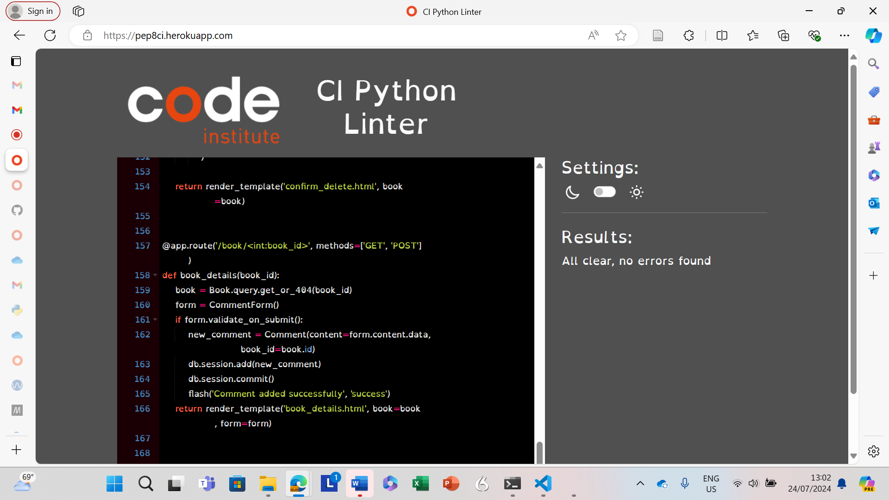

### models.py

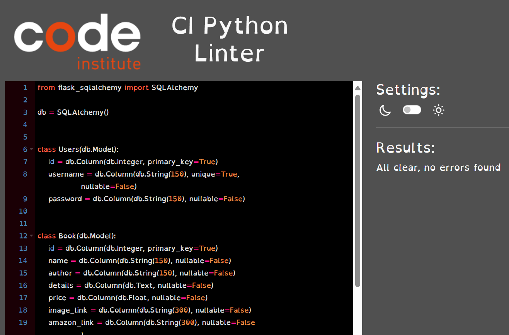

### forms.py

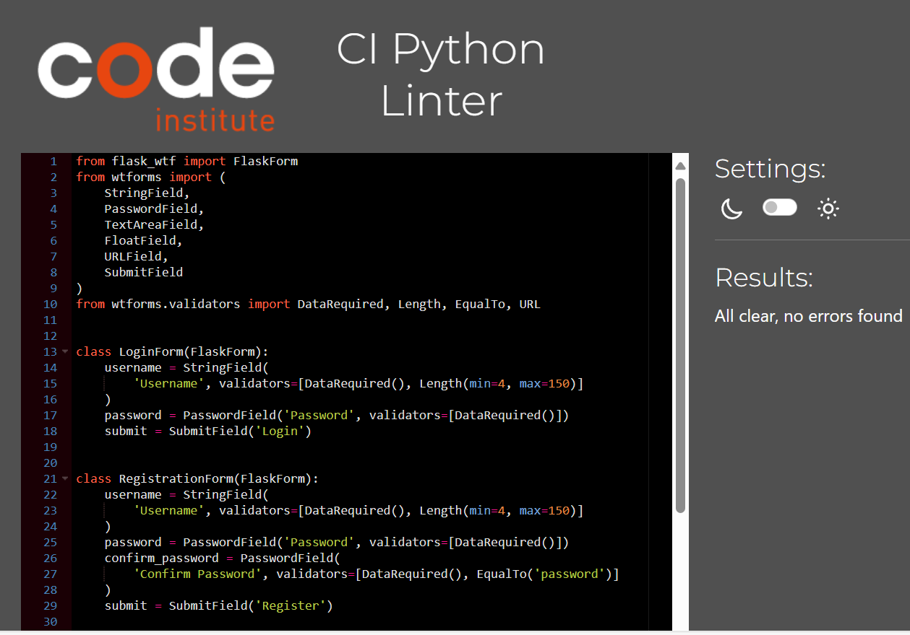

### config.py
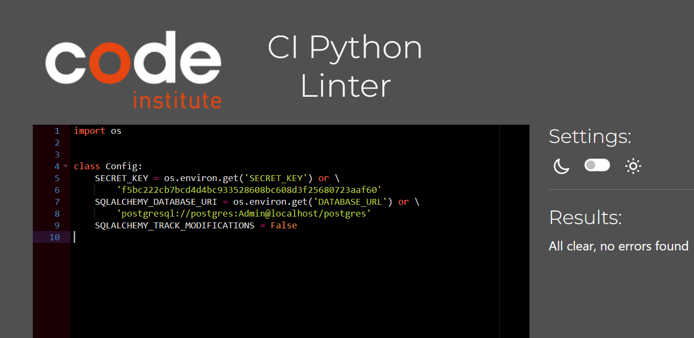

### Manual Testing

### Testing User Stories

#### First Time Visitors

| Goals                                                        | How are they achieved?                                                                                                         |
| :----------------------------------------------------------- | :----------------------------------------------------------------------------------------------------------------------------- |
| Register for an account                                    | There is a sign up link on the home page which encourages a user to create an account.
| Search for books | Once a user has signed up to an account. They can search for a book and leave a comment.
| Understand what the site is for and easily navigate their way around                          |   A description of what the site is is included on the home page.                                         |
| I want the website to be responsive across varying devices.  | Bootstrap has been used in order to make book1-review-app responsive across a variety of devices.                               |

#### Returning Visitors and Frequent Visitors

| Goals                                                                    | How are they achieved?                                                                                                                                                              |
| :----------------------------------------------------------------------- | :---------------------------------------------------------------------------------------------------------------------------------------------------------------------------------- |
| Log into created account.                 |  If a user is not logged into an account, a login registration/link is provided on the navbar on home page.                                              |
|Create, edit and delete my own reviews. | A user has access to all of their reviews on the 'My Reviews Page' from here the user can edit and delete any existing reviews. They can create a new review searching for a book.
|Read other users reviews. | 

### User Testing Summary

The primary purpose of the site is to create an engaging and user-friendly platform where book lovers can share and discover other opinions. This website is designed to serve as a comprehensive resource for individuals looking to gain knowledge into thriller and courtroom stories.

Whether you're a first time visitor, returning user or a frequent reviewer, Padomabook-review-app offers a tailored experience that meets the needs of it's target audience. Which I believe makes the website a success and meets all of the initial goals set prior to creating the website. 

### Full Testing

Full testing was performed on the following devices:

- Laptop:

  - Lenovo V14 G2 ALC

- Mobile Devices:
  - iPhone 15 pro max.
  - iPhone 14 pro max.
  - Phone X.

Each device tested the site using the following browsers:

- Google Chrome
- Safari

#### Nav Bar

| Feature                                            | Expected Outcome                                                       | Testing Performed                  | Result                                                      | Pass/Fail |
| -------------------------------------------------- | ---------------------------------------------------------------------- | ---------------------------------- | ----------------------------------------------------------- | --------- |
| ReelTalk Logo                                   | Link directs the user back to the home page                            | Clicked title                      | Home page reloads                                           | Pass      |
| Login link (only shown if user is not logged in)                             | Directs user to the login page                                      | Clicked link                       | Redirected to the login page                                           | Pass      |
| Book reviews link (logged in users only) | Directs user to the book reviews page | Clicked link                       | Redirected to the book reviews page                           | Pass      |
| My reviews link (logged in users only) | Directs user to the my reviews page | Clicked link                       | Redirected to the my reviews page                           | Pass      |
| Review a book link (logged in users only) | Directs user to the Review a book page | Clicked link                       | Redirected to the Review a book page                           | Pass      |
| Logout link (logged in users only) | Directs user to the home page | Clicked link                       | Redirected to the home page                           | Pass      |

### Footer

| Feature                                            | Expected Outcome                                                       | Testing Performed                  | Result                                                      | Pass/Fail |
| -------------------------------------------------- | ---------------------------------------------------------------------- | ---------------------------------- | ----------------------------------------------------------- | --------- |
| Facebook link                                   | Directs the user to Facebooks webpage in a new tab                             | Clicked logo                      | New tab opens on Facebooks webpage.                                           | Pass      |
| Twitter link                                   | Directs the user to Twitters webpage in a new tab                             | Clicked logo                      | New tab opens on Twitters webpage.                                           | Pass      |
| Instagram link                                   | Directs the user to Instagrams webpage in a new tab                             | Clicked logo                      | New tab opens on Instagrams webpage.                                           | Pass      |

#### Home Page

| Feature                                            | Expected Outcome                                                       | Testing Performed                  | Result                                                      | Pass/Fail |
| -------------------------------------------------- | ---------------------------------------------------------------------- | ---------------------------------- | ----------------------------------------------------------- | --------- |
| Sign up button (logged out users only)                                    | Link directs the user to the sign up page                            | Clicked sign up button                      | Redirected to the sign up page                                           | Pass      |
| Login link (only shown if user is not logged in)                             | Directs user to the login page                                      | Clicked link                       | Redirected to the login page                                           | Pass      |
| Trending movied | The weeks top 12 trending movied are displayed | Loaded home page                       | Movie cards are dispplayed                           | Pass      |

#### Register Page

| Feature                                            | Expected Outcome                                                       | Testing Performed                  | Result                                                      | Pass/Fail |
| -------------------------------------------------- | ---------------------------------------------------------------------- | ---------------------------------- | ----------------------------------------------------------- | --------- |
| First name input                                    | The users first name should be more than 2 characters long                            | Entered first name less than 2 characters long                      | Flash message alerts the user they have not entered enough characters                                           | Pass      |
| Last name input                                    | The users should enter their last name                            | Entered last name                       |                                                                                  | Pass      |
| Password input                                    | The users password should be between 4 and 8 characters long                            | Entered password less than 4 and more than 8 characters long                      | Flash message alerts the user they have not matched the correct criteria                                          | Pass      |
| Confirm password input                                    | The users password should match the password input field                            | Entered password which differs from the password input field                      | Flash message alerts the user that the passwords do not match                                          | Pass      |
| Register button                                    | Link directs the user to the home page and displayed a message indicating the user has been created                            | Clicked register button                      | Redirected to the home page. Flash message displayed                                           | Pass      |

#### Login Page

| Feature                                            | Expected Outcome                                                       | Testing Performed                  | Result                                                      | Pass/Fail |
| -------------------------------------------------- | ---------------------------------------------------------------------- | ---------------------------------- | ----------------------------------------------------------- | --------- |
| Name input                                    | User to enter e-mail address                            | Enter 
Full Name                     | Flash message alerts the user if the name doesn't exist in the database                                           | Pass      |
| Password input                                    | User to enter password                            | Enter password                     | Flash message alerts the user if the password is incorrect                                           | Pass      |
| Login button                                    | Directs the user to the 'My Reviews' page and a flash message appears with 'Successful Login'                            | Click button                     | Redirected to the 'My Reviews' page                                           | Pass      |

#### My Reviews Page

| Feature                                            | Expected Outcome                                                       | Testing Performed                  | Result                                                      | Pass/Fail |
| -------------------------------------------------- | ---------------------------------------------------------------------- | ---------------------------------- | ----------------------------------------------------------- | --------- |
| Edit button                                    | User directed to the edit review page                           | Click edit button                     | Redirected to the edit review page                                           | Pass      |
| Delete button                                    | Modal appears confirming if the user wants to delete the review                           | Clicked delete button                     | Modal appears with  a delete and close button                                           | Pass      |
| Delete button on modal                                    | Once clicked the review will be deleted and a message displayed confirming that the review has been deleted                           | Clicked delete button                     | Review is deleted and message displayed                                           | Pass      |
| Close button on modal                                    | Once clicked the modal will close                         | Clicked close button                     | Modal is closed                                           | Pass      |
| No Reviews                                    | If the user has not posted any reviews a message is displayed stating now reviews have been made yet                         | No reviews created                    | Message displayed stating no reviews made                                           | Pass      |

#### Edit Comments Page

| Feature                                            | Expected Outcome                                                       | Testing Performed                  | Result                                                      | Pass/Fail |
| -------------------------------------------------- | ---------------------------------------------------------------------- | ---------------------------------- | ----------------------------------------------------------- | --------- |
| Text input                                  | Users review is displayed ready to edit                           | Review editied                     | Review saved to the database with a flash message of success                                         | Pass      |
| Update review button                                  | User is directed to their 'My Reviews' page and a sucess message is displayed                           | Clicked update review button                     |  User redirected to the 'My Reviews' page and success message displayed                                       | Pass      |
| Back button                                  | User is directed to their 'My Reviews' page                           | Clicked back button                     |  User redirected to the 'My Reviews' page                                        | Pass      |

#### Search Movies Page

| Feature                                            | Expected Outcome                                                       | Testing Performed                  | Result                                                      | Pass/Fail |
| -------------------------------------------------- | ---------------------------------------------------------------------- | ---------------------------------- | ----------------------------------------------------------- | --------- |
| Search input                                  | User to enter a book title                           | Book  title entered                     | The search returns the book title                                         | Pass      |
| Search input (No result)                                  | User to enter a movie title                           | Book title entered                     | Flash message indicates there is no such book title                                         | Pass      |
| Search button                                  | Directs user to search results page                           | Clicked button                     | Redircted to the search results page                                        | Pass      |

#### 403 & 404 Pages

| Feature                                            | Expected Outcome                                                       | Testing Performed                  | Result                                                      | Pass/Fail |
| -------------------------------------------------- | ---------------------------------------------------------------------- | ---------------------------------- | ----------------------------------------------------------- | --------- |
| 403 - User tries to access another users reviews to edit/delete review                                  | 403 page is displayed                           | Tried to access another users reviews via the URL address                     | 403 page displayed along with a flash message                                         | Pass      |
| 404 - User tries to access a page which doesn't exist on the website                               | 404 page is displayed                           | Tried to access a webpage which doesnt exist on the website                     | 404 page displayed                                          | Pass      |

